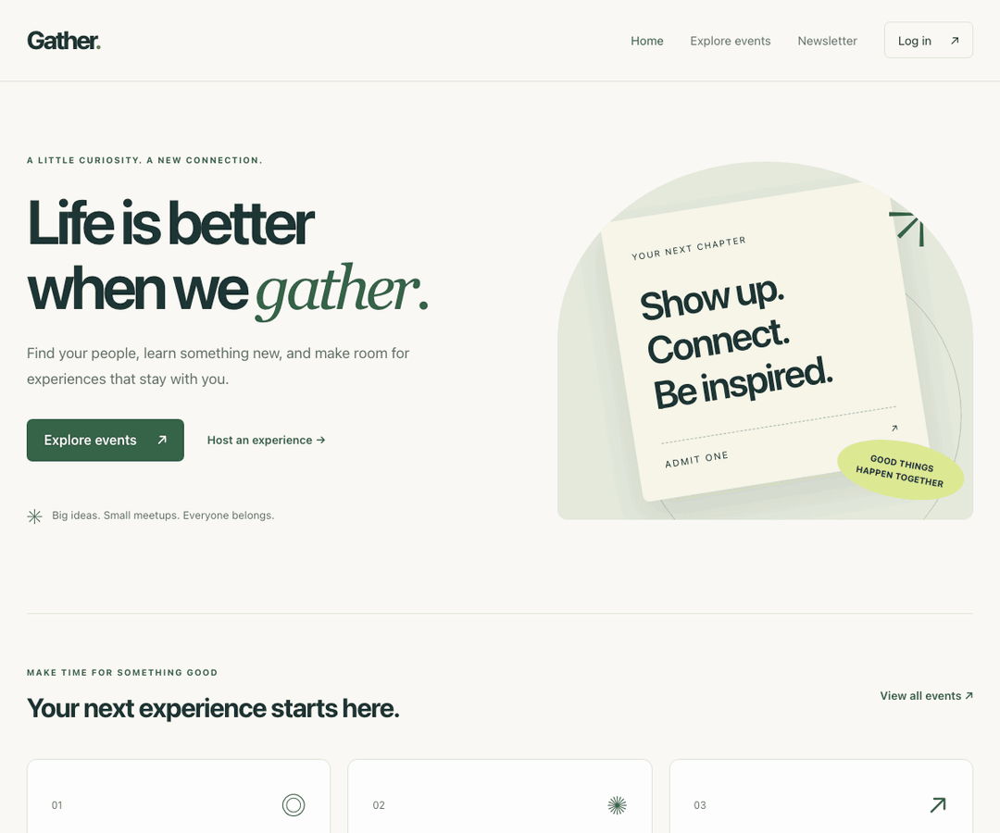

# Gather

Gather is a small app for finding and sharing community events. You can browse
without an account, filter by date, and save favorites in your browser. Sign in
to post an event. Only its creator can edit or delete it.

The frontend uses React, TypeScript, React Router, and Vite. The backend is an
Express API that stores data in a local JSON file.

## A quick look



The recording uses local sample data. A fresh install starts with an empty event list.

## Run it locally

You'll need npm and Node.js 24.15 or newer in the 24.x line, or Node 26+.
If you use nvm, run `nvm install` and `nvm use` from the project root.

Install the dependencies and start the API:

```sh
npm run setup
npm run dev:api
```

Then open a second terminal and start the frontend:

```sh
npm run dev
```

Visit [localhost:5173](http://localhost:5173). The API runs on port 8080.
Use `localhost` for both services; mixing it with `127.0.0.1` will cause problems
with session cookies.

Create an account to add your first event. Unless you set `JWT_SECRET`, restarting
the API signs you out because development uses a new signing key on each start.

## Settings

The defaults work for local development. To change the API address, copy
`frontend/.env.example` to `frontend/.env.local` and set `VITE_API_URL`.
Restart Vite after changing it, or rebuild if you're serving the production bundle.

For backend settings, export the variables in your shell or create `backend/.env`
from `backend/.env.example`. To load that file, run this from the `backend` directory:

```sh
node --env-file=.env src/server.js
```

| Variable | Default | What it does |
| --- | --- | --- |
| `PORT` | `8080` | Sets the API port. |
| `CORS_ORIGIN` | `http://localhost:5173` in development | Sets the exact frontend origin allowed to call the API. Production requires an explicit HTTPS origin. |
| `JWT_SECRET` | Generated on startup in development | Signs session tokens. Production requires a random secret of at least 32 characters. |
| `EVENTS_DATA_FILE` | `backend/storage/application-data.json` | Chooses where the API stores its data. |
| `VITE_API_URL` | `http://localhost:8080` | Tells the frontend where to find the API. |

Values prefixed with `VITE_` end up in the browser bundle. Don't put secrets there.

## Working on the project

Run the tests, coverage checks, TypeScript check, and production build with:

```sh
npm run check
```

API tests use temporary files. They don't change your local events or accounts.
For frontend tests that rerun as you edit, use `npm run test:watch --prefix frontend`.

Most changes belong in one of these directories:

```text
frontend/src/
  app/           Router and page layouts
  features/      Events, authentication, and newsletter signup
  components/    Shared UI
  lib/           API client and configuration
  styles/        Global styles
backend/
  src/           Routes, middleware, services, and data access
  scripts/       Local data setup
  storage/       Local data and the empty example file
  tests/         API and unit tests
docs/            Demo, change notes, and security details
```

Frontend component tests and styles sit next to their components. The API's
entry point is `backend/src/server.js`; `app.js` defines the app separately so
tests can use it without starting the server.

## Your data

Setup creates `backend/storage/application-data.json` only if it doesn't already
exist. It never replaces your data. This file holds events, accounts, sessions,
and newsletter subscriptions, so it's ignored by Git. Keep it and any backups
out of public folders and source archives.

To use a different location, export `EVENTS_DATA_FILE` and run
`node backend/scripts/initialize-data.js` from the project root. The same rule
applies: an existing file is left alone.

Older events without an `ownerId` stay read-only. To assign one, first verify who
owns the event, stop the API, and back up the file. Then set `ownerId` to that
person's existing user ID.

The newsletter form saves email addresses. It doesn't send email yet.

## Before deploying

Build with `npm run build` and serve `frontend/dist`. The frontend host needs to
serve `index.html` for routes such as `/events/new`. Run the API separately with
`NODE_ENV=production`, `JWT_SECRET`, and `CORS_ORIGIN` set.

A few things matter here:

- Use HTTPS and keep the frontend and API on the same site, such as
  `app.example.com` and `api.example.com`. The session cookie won't work across
  unrelated domains.
- Run one API process per data file. Writes are queued within that process;
  multiple processes sharing the JSON file are not supported. Move to a
  transactional database before running more than one instance.
- Review your proxy setup. The API doesn't trust forwarded IP headers by default.
  Login and signup share a limit of 30 attempts per IP every 15 minutes; newsletter
  signup allows 10. These limits reset on restart and aren't shared across instances.
- Email verification and account recovery aren't implemented.

Sessions use HttpOnly cookies, expire after an hour, and are revoked on logout.
Up to five sessions can stay active per account. If you're upgrading from the
older Bearer-token version, sign in again. API clients also need to switch to
cookies and send the CSRF header described in the
[session migration notes](docs/security-hardening.md#api-migration).

## More details

- [Contributing](.github/CONTRIBUTING.md)
- [Reporting a security issue](.github/SECURITY.md)
- [Security fixes and remaining limits](docs/security-hardening.md)
- [Feature changes](docs/improvements.md)
- [Dependency updates](docs/dependencies.md)
- [Changelog](CHANGELOG.md)
- [License](LICENSE.md)
